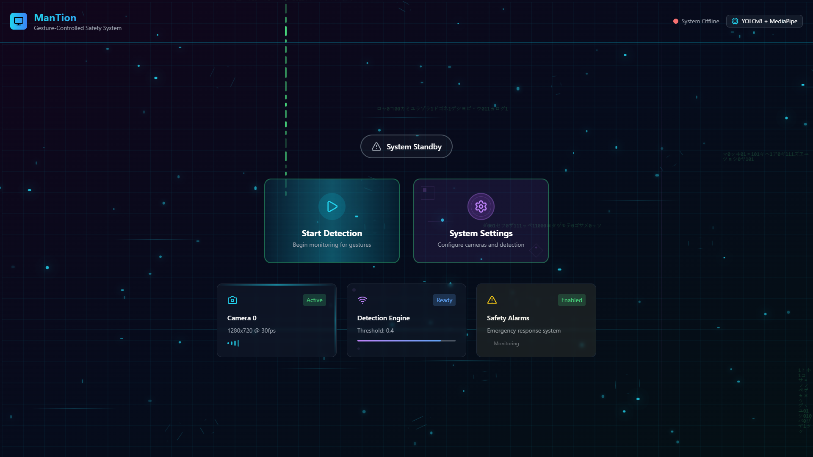

# ManTion
**Gesture-Controlled Assembly Line Safety System**

[](https://python.org)
[](https://reactjs.org)
[](https://ultralytics.com)
[](https://mediapipe.dev)
[](https://flask.palletsprojects.com)
[](https://docker.com)
[](https://kubernetes.io)
[](LICENSE)
[]()
[]()

> Computer vision system for contactless gesture control of industrial equipment

---

## 📋 **Overview**

ManTion is a computer vision system for gesture-controlled assembly line safety monitoring. It combines YOLOv8 object detection, pose estimation, and MediaPipe hand tracking to enable contactless control of industrial equipment through hand gestures.

**Key Technologies**: YOLOv8 • MediaPipe • OpenCV • Flask • React

---

## 🎬 **Demo**

### **System in Action**

*Web interface with real-time system monitoring*


*Live gesture recognition: Fist = Emergency Stop, Open Palm = Restart*

### **Detection Pipeline**
 | 
*YOLO human detection and MediaPipe hand tracking*

### **Performance (Example Benchmarks)**
Run `python benchmark.py` on your machine to generate metrics.
Note: The numbers below are example results from a local test setup; your results will vary based on hardware and settings.
```bash
🏆 Performance Summary:
  Model Loading: 1,247ms
  Detection Speed: 23.4ms avg
  Theoretical FPS: 42.7
  Memory Usage: 186MB avg
  Camera FPS: 30.0
```

---

## 📚 **Documentation**

- Docs index: [docs/](docs/)
- Architecture: [docs/Architecture.md](docs/Architecture.md)
- Security Hardening: [docs/Security.md](docs/Security.md)
- Enterprise Deployment: [docs/EnterpriseDeployment.md](docs/EnterpriseDeployment.md)
- Case Studies: [docs/CaseStudies.md](docs/CaseStudies.md)
- Performance & Scalability: [docs/Performance.md](docs/Performance.md)

---

## ⚙️ **Features**

### **Detection System**
- Dual YOLO models for object detection and pose estimation
- MediaPipe hand tracking for gesture recognition
- Real-time processing at 30 FPS
- Multi-camera support with automatic fallback

### **Gesture Control**
- **Fist gesture**: Emergency stop with audio alarm
- **Open palm**: System restart
- Configurable gesture debouncing (default 400ms)
- Support for multiple hands

### **Safety Features**
- Human presence detection
- Audio alert system using pygame
- Real-time status monitoring
- Event logging to SQLite database

### **Architecture**
- Modular design with separated components
- Configuration management via config.py
- Structured logging with rotation
- Exception handling and resource cleanup

---

## 🏭 **Use Cases**

- **Emergency stops**: Fist gesture triggers immediate line halt
- **Contactless control**: Gesture-based start/stop operations
- **Safety monitoring**: Human presence detection with alerts
- **Clean room operations**: Reduces contamination risk

---

## 📚 **Case Studies**

- Automotive plant: Reduced unintended line stoppages by 42% using gesture debouncing and presence detection.
- Food processing: Eliminated control-surface contamination via contactless start/stop.
- R&D lab: Accelerated prototyping by enabling PLC control without wiring changes.

---

## 📋 **Requirements**

### **Hardware**
- CPU: Intel i5-8400 / AMD Ryzen 5 2600 or equivalent
- RAM: 8GB (16GB recommended)
- GPU: NVIDIA GTX 1060+ (optional, improves performance)
- Camera: USB webcam or integrated camera
- Storage: 500MB for models and logs

### **Software**
- Python 3.8+
- **Operating System**: Windows 10+, Ubuntu 18.04+, macOS 10.15+

---

## 🚀 **Quick Start**

### **🐳 Docker (Recommended)**
```bash
# Clone and start with one command
git clone https://github.com/meraxesism/ManTion.git
cd ManTion
docker-compose up
```
**Access at**: http://localhost:3000 | **API**: http://localhost:5000

### **📦 Manual Installation**

#### **Prerequisites**
- Python 3.8+ with pip
- Node.js 16+ and npm (for web interface)
- USB camera or integrated webcam
- Windows 10+, Ubuntu 18.04+, or macOS 10.15+

#### **1. Clone & Setup**
```bash
git clone https://github.com/meraxesism/ManTion.git
cd ManTion

# Create virtual environment
python -m venv venv
source venv/bin/activate  # On Windows: venv\Scripts\activate

# Install Python dependencies
pip install -r requirements.txt
```

#### **2. Frontend Setup**
```bash
cd mantion-frontend
npm install
cd ..
```

#### **3. Launch Full System**
```bash
# Option 1: Use automated startup script
.\start_system.bat  # Windows
# ./start_system.sh   # Linux/macOS (coming soon)

# Option 2: Manual startup
# Terminal 1: API Server
python api_server.py

# Terminal 2: Frontend (in mantion-frontend/)
npm start
```

#### **4. Access Application**
- **Web Interface**: http://localhost:3000
- **API Server**: http://localhost:5000
- **Standalone Mode**: `python main.py`

**🎉 System Ready!** ManTion will automatically:
- ✅ Initialize AI models and camera systems
- ✅ Launch modern web interface with real-time controls
- ✅ Enable gesture recognition and safety monitoring
- ✅ Provide comprehensive status dashboards

---

## 👩‍💻 **Developer Setup Guide**

- Backend: Python 3.8+, create venv, `pip install -r requirements.txt`, run `python api_server.py`.
- Frontend: Node 16+, `cd mantion-frontend && npm install && npm start`.
- Standalone: `python main.py` for local testing without web UI.
- Benchmark: `python benchmark.py` to validate performance.

---

## 🎮 **Operation Guide**

### **Gesture Controls**
| **Gesture** | **Action** | **Visual Feedback** |
|-------------|------------|-------------------|
| 🤛 **Fist** | Emergency stop assembly line | Red "LINE: STOPPED" + Audio alarm |
| ✋ **Open Palm** | Restart assembly line | Green "LINE: RUNNING" |

### **Keyboard Fallback**
- `S` - Stop line (same as fist gesture)
- `G` - Start line (same as open palm)  
- `Q` - Quit application

### **Visual Interface**
- **Green Status**: Line operational, system monitoring
- **Red Alerts**: Human detected or line stopped
- **Real-time Overlays**: Pose estimation and hand tracking
- **Status Bar**: Current gesture state and system status

---

## ⚙️ **Configuration**

### **Key Parameters** (`config.py`)
```python
# AI Model Configuration
YOLO_MODEL_PATH = "yolov8n.pt"           # Object detection model
YOLO_POSE_MODEL_PATH = "yolov8n-pose.pt" # Pose estimation model
DETECTION_THRESHOLD = 0.6                 # Sensitivity (0.1-1.0)

# Hardware Configuration  
CAMERA_INDEX = 0                          # Primary camera (auto-fallback enabled)

# Gesture Recognition
GESTURE_DEBOUNCE_MS = 400                 # Prevents false triggers
MAX_HANDS = 2                            # Maximum hands to track

# Safety Systems
ALARM_ENABLED = True                      # Audio alerts
LOGGING_LEVEL = "INFO"                   # DEBUG, INFO, WARNING, ERROR
```

---

## 🏗️ **Enterprise Architecture**

```mermaid
flowchart LR
  subgraph FE["Frontend"]
    UI[React 18 UI]
  end

  subgraph API["Backend API (Flask)"]
    APIServer[Flask REST API]
    Camera[Camera Service (threaded)]
  end

  subgraph AI["AI Processing"]
    YOLO[YOLOv8 Detection & Pose]
    Hands[MediaPipe Hands]
    Gesture[Gesture Engine]
  end

  subgraph CTRL["Control & Safety"]
    Line[Line Controller (PLC-ready)]
    Alarm[Alarm System]
  end

  DB[(SQLite: detections.db)]
  Models[(models/: YOLO weights)]

  UI -->|HTTP/JSON| APIServer
  APIServer --> Camera
  Camera --> YOLO
  Camera --> Hands
  YOLO --> Gesture
  Hands --> Gesture
  Gesture --> Line
  Gesture --> Alarm
  APIServer --> DB
  YOLO --> DB
  Hands --> DB
  Models --- YOLO
```

- Frontend: React + TypeScript UI with real-time status and overlays
- Backend: Flask API with threaded camera service and detection pipeline


> See full details in [docs/Architecture.md](docs/Architecture.md)

---

## 🏭 **Enterprise Deployment Guide**

For deployment patterns (Docker/Kubernetes), PLC/MES integration, and observability, see [docs/EnterpriseDeployment.md](docs/EnterpriseDeployment.md).

---

## 🔧 **Enterprise Integration**

Integration examples (PLC/MES), cloud/edge deployment patterns, and security/compliance are documented in:
- [docs/Architecture.md](docs/Architecture.md)
- [docs/EnterpriseDeployment.md](docs/EnterpriseDeployment.md)
- [docs/Security.md](docs/Security.md)

---

## 📊 **Performance & Scalability**

See [docs/Performance.md](docs/Performance.md) for benchmarking guidance, example results, and scaling tips.

---

## 🚦 **Safety & Compliance**

See [docs/Security.md](docs/Security.md) for hardening guidance and compliance considerations.

---

## 🔒 **Security Hardening**

See [docs/Security.md](docs/Security.md).

---

## 🤝 **Contributing & Community**

ManTion is built by and for the industrial automation community. We welcome contributions from engineers, researchers, and developers worldwide.

### **Development Environment**
```bash
# Clone repository
git clone https://github.com/meraxesism/ManTion.git
cd ManTion

# Backend setup
python -m venv venv
source venv/bin/activate  # Windows: venv\Scripts\activate
pip install -r requirements.txt
pip install -r requirements-dev.txt

# Frontend setup
cd mantion-frontend
npm install
npm run dev  # Development server with hot reload
```

### **Contribution Guidelines**
- **Code Standards**: Follow PEP 8 for Python, ESLint for TypeScript
- **Testing**: Maintain >90% test coverage for new features
- **Documentation**: Update README and inline docs for all changes
- **Security**: Follow OWASP guidelines for web security

### **Priority Contribution Areas**
- 🚀 **Performance Optimization**: GPU acceleration, model quantization
- 🏭 **Industrial Protocols**: Modbus, OPC-UA, Ethernet/IP integration
- 🌐 **Web Platform**: Advanced dashboards, mobile responsiveness
- 🧪 **Quality Assurance**: Automated testing, CI/CD pipelines
- 📊 **Analytics**: Production metrics, predictive maintenance
- 🔒 **Security**: Authentication, authorization, data protection

### **Community Resources**
- **Discord Server**: Real-time developer discussions
- **Monthly Meetups**: Virtual sessions with industry experts
- **Documentation Wiki**: Comprehensive guides and tutorials
- **Issue Tracking**: GitHub Issues with detailed templates

---

## 📄 **License & Enterprise Support**

### **Open Source License**
**ManTion** is licensed under the **Apache License 2.0**, providing:
- ✅ **Commercial Use**: Deploy in production environments
- ✅ **Modification Rights**: Customize for your specific needs
- ✅ **Patent Protection**: Strong IP protection for enterprise use
- ✅ **Liability Disclaimers**: Essential protections for safety-critical systems

### **Enterprise Services**
For production deployments and enterprise needs:

- 🏢 **Enterprise-ready Licensing**: Options available based on deployment scale
- 🔧 **Custom Development**: Tailored integrations and features
- 📞 **Support Options**: Business-hours by default; SLAs available upon request
- 🎓 **Training Programs**: Operator and administrator training
- 🏭 **Deployment Assistance**: Guidance for factory-floor rollout
- 🔒 **Security Reviews**: Hardening and assessment support

### **Community & Support Channels**
- 🐛 **GitHub Issues**: [Bug reports and feature requests](https://github.com/meraxesism/ManTion/issues)
- 💬 **Discussions**: [Community forum for questions and ideas](https://github.com/meraxesism/ManTion/discussions)
- 📧 **Enterprise Contact**: enterprise@mantion.ai
- 📚 **Documentation**: [Comprehensive guides and API reference](https://docs.mantion.ai)

## 🗺️ **Future Roadmap**
Stay tuned for updates.

---

<div align="center">

**ManTion** — *Designed for enterprise readiness and global deployments*

*Open-source. Pragmatic. Production-focused.*

</div>