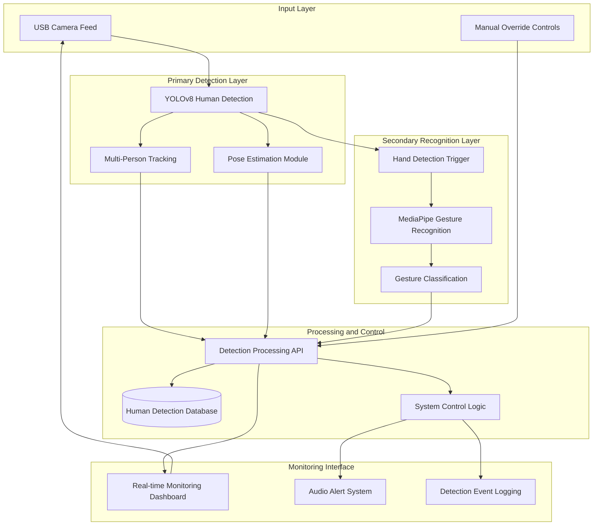

# ManTion
**Real-time Human Detection System with Gesture Control Integration**

[](https://python.org)
[](https://reactjs.org)
[](https://ultralytics.com)
[](https://mediapipe.dev)
[](https://flask.palletsprojects.com)
[](LICENSE)

> Advanced computer vision system for human presence detection with supplementary gesture control capabilities

## Abstract

ManTion implements a real-time computer vision system primarily designed for human detection and monitoring in industrial environments. The system leverages YOLOv8 object detection and pose estimation for comprehensive human presence tracking, with an integrated gesture recognition module using MediaPipe for supplementary contactless control functionality.

**Primary Focus**: Human Detection and Presence Monitoring  
**Secondary Feature**: Gesture-based Control Interface  
**Core Technologies**: YOLOv8 Object Detection • Pose Estimation • MediaPipe Hand Tracking • OpenCV • Flask REST API • React Frontend

---

## System Overview

### Primary Function: Human Detection
The core functionality centers on robust human detection and monitoring:

1. **Human Presence Detection**: YOLOv8 model identifies and tracks human subjects in the operational area
2. **Pose Estimation**: Real-time skeletal tracking for human activity monitoring
3. **Multi-person Tracking**: Simultaneous detection and tracking of multiple individuals
4. **Safety Zone Monitoring**: Continuous surveillance of designated areas with alert systems

### Secondary Function: Gesture Control
Supplementary gesture recognition capabilities:

1. **Hand Detection**: MediaPipe Hands identifies hand presence when humans are detected
2. **Gesture Classification**: Basic gesture recognition for control commands
3. **Control Integration**: Simple gesture-to-command mapping for system interaction

### Technical Stack
```
Frontend:    React 18 + TypeScript + Tailwind CSS
Backend:     Flask 2.x + Python 3.8+
Primary CV:  YOLOv8 (Human Detection + Pose Estimation)
Secondary CV: MediaPipe Hands (Gesture Recognition)
Database:    SQLite (detection and event logging)
Deployment:  Docker + Docker Compose
```

---

## Features

### Human Detection and Monitoring (Primary)
- **Multi-model Human Detection**: YOLOv8 object detection optimized for human subjects
- **Real-time Pose Estimation**: 17-keypoint skeletal tracking for activity analysis
- **Presence Monitoring**: Continuous tracking of human subjects in operational zones
- **Multi-person Support**: Simultaneous detection and tracking of multiple individuals
- **Safety Zone Alerts**: Configurable area monitoring with immediate notifications
- **Activity Logging**: Comprehensive database logging of all human detection events

### Gesture Control Integration (Secondary)
- **Conditional Activation**: Gesture recognition only activates when humans are detected
- **Basic Gesture Set**: Fist (stop command) and open palm (start command)
- **Control Interface**: Simple gesture-to-system-command mapping
- **Temporal Filtering**: Debouncing to prevent accidental gesture triggers
- **Confidence Scoring**: Probabilistic gesture classification with adjustable thresholds

### System Monitoring and Safety
- **Real-time Dashboard**: Web-based interface showing detection status and activity
- **Audio Alert System**: Configurable notifications for detection events
- **Event Logging**: Comprehensive database tracking of all detections and system events
- **Performance Monitoring**: Built-in metrics for system health and detection accuracy

### Integration Capabilities
- **RESTful API**: JSON endpoints for external system integration
- **WebSocket Streaming**: Real-time detection data for connected systems
- **Database Integration**: SQLite backend with structured event logging
- **Modular Architecture**: Separated detection and control components

---

## Installation and Deployment

### System Requirements

**Hardware Requirements**
- **CPU**: Multi-core processor (Intel i5-8400 / AMD Ryzen 5 2600 equivalent)
- **Memory**: 8GB RAM minimum (16GB recommended for multi-person detection)
- **GPU**: NVIDIA GPU with CUDA support (optional, significantly improves detection performance)
- **Camera**: USB webcam or integrated camera (720p minimum resolution)
- **Storage**: 1GB available space for models and detection data

**Software Requirements**
- **Operating System**: Windows 10+, Ubuntu 18.04+, macOS 10.15+
- **Python**: 3.8 or higher with pip package manager
- **Node.js**: 16.x or higher with npm (for monitoring interface)

### Docker Deployment (Recommended)

```bash
# Clone repository
git clone https://github.com/meraxesism/ManTion.git
cd ManTion

# Deploy with Docker Compose
docker-compose up -d

# Access interfaces
# Monitoring Dashboard: http://localhost:3000
# Detection API: http://localhost:5000
```

### Manual Installation

```bash
# 1. Clone repository and create virtual environment
git clone https://github.com/meraxesism/ManTion.git
cd ManTion
python -m venv venv
source venv/bin/activate  # Windows: venv\Scripts\activate

# 2. Install Python dependencies
pip install -r requirements.txt

# 3. Install frontend dependencies
cd mantion-frontend
npm install
cd ..

# 4. Start detection backend
python api_server.py

# 5. Start monitoring dashboard (new terminal)
cd mantion-frontend
npm start
```

### System Verification

```bash
# Test detection system
python main.py

# Run detection benchmarks
python benchmark.py

# Verify detection API
curl http://localhost:5000/api/detections
```

---

## Configuration

### Core Configuration (`config.py`)

```python
# Primary Detection Configuration
YOLO_MODEL_PATH = "yolov8n.pt"           # Human detection model
YOLO_POSE_MODEL_PATH = "yolov8n-pose.pt" # Pose estimation model
HUMAN_DETECTION_THRESHOLD = 0.6          # Human detection confidence threshold
POSE_DETECTION_THRESHOLD = 0.5           # Pose keypoint confidence threshold

# Secondary Gesture Configuration
GESTURE_ENABLED = True                   # Enable/disable gesture recognition
GESTURE_DETECTION_THRESHOLD = 0.7        # Gesture classification threshold
GESTURE_DEBOUNCE_MS = 400                # Minimum time between gesture commands

# Hardware Configuration
CAMERA_INDEX = 0                         # Primary camera device index
CAMERA_RESOLUTION = (640, 480)           # Camera resolution for detection
CAMERA_FPS = 30                          # Target camera framerate

# Monitoring Configuration
MAX_DETECTION_HISTORY = 1000             # Maximum detection records to store
ALERT_ENABLED = True                     # Audio alert system
DETECTION_LOGGING_LEVEL = "INFO"         # Detection event logging verbosity

# Safety Zone Configuration
SAFETY_ZONES = [
    {"name": "restricted_area", "coordinates": [(100, 100), (500, 400)]},
    {"name": "monitoring_zone", "coordinates": [(0, 0), (640, 480)]}
]
```

---

## API Reference

### Human Detection Endpoints

**GET /api/detections/current**
```json
{
  "timestamp": "2024-01-15T10:30:45Z",
  "humans_detected": 2,
  "detections": [
    {
      "person_id": 1,
      "bounding_box": [120, 150, 300, 450],
      "confidence": 0.92,
      "pose_keypoints": [...],
      "in_safety_zone": true,
      "zone_name": "monitoring_zone"
    }
  ],
  "gesture_active": false
}
```

**GET /api/detections/history**
```json
{
  "detections": [
    {
      "timestamp": "2024-01-15T10:30:45Z",
      "person_count": 1,
      "detection_confidence": 0.89,
      "pose_detected": true,
      "gestures": ["none"]
    }
  ],
  "total_records": 150,
  "time_range": "last_24_hours"
}
```

**GET /api/system/status**
```json
{
  "system_status": "active",
  "camera_connected": true,
  "models_loaded": true,
  "detection_active": true,
  "gesture_recognition": true,
  "current_human_count": 1,
  "uptime_seconds": 3600
}
```

### Control Endpoints (Gesture Integration)

**POST /api/control/gesture**
```json
{
  "gesture": "fist|palm|none",
  "confidence": 0.85,
  "action_taken": "stop_command|start_command|none"
}
```

**POST /api/control/manual**
```json
{
  "command": "start|stop|reset",
  "source": "manual_override"
}
```

---

## System Architecture



### Component Responsibilities

**YOLOv8 Human Detection (Primary)**
- Human presence detection with bounding box localization
- Confidence scoring for detection reliability
- Multi-person identification and tracking
- Optimized inference for real-time performance

**Pose Estimation Module (Primary)**
- 17-keypoint skeletal tracking for detected humans
- Activity analysis and posture monitoring
- Movement pattern recognition
- Safety posture detection

**MediaPipe Gesture Recognition (Secondary)**
- Activated only when humans are detected
- Hand landmark extraction and tracking
- Basic gesture pattern recognition
- Integration with control command mapping

**Detection Processing API**
- Centralized processing of all detection events
- Data aggregation and filtering
- Event logging and database integration
- Real-time data streaming to connected interfaces

---

## Performance Analysis

### Detection Performance Metrics

**Human Detection Accuracy**
- **Precision**: >95% in well-lit indoor environments
- **Recall**: >90% for standing human subjects
- **Multi-person**: Supports up to 10 simultaneous detections
- **Processing Speed**: 15-30 FPS depending on hardware configuration

**Pose Estimation Performance**
- **Keypoint Accuracy**: Sub-pixel precision in ideal conditions
- **Tracking Stability**: >85% keypoint consistency across frames
- **Occlusion Handling**: Partial pose estimation with missing keypoints
- **Computational Overhead**: +5-10ms per detected person

**Gesture Recognition (Secondary)**
- **Activation Rate**: Only processes when hands are visible
- **Gesture Accuracy**: ~80-85% for basic fist/palm gestures
- **Response Time**: 400-600ms including debouncing
- **False Positive Rate**: <5% with proper threshold tuning

### Computational Requirements
```
Human Detection (Primary):    70-80% of computational load
Pose Estimation:              15-20% of computational load  
Gesture Recognition:          5-10% of computational load
System Overhead:              <5% of computational load
```

### Hardware Scaling
```
CPU-only (Intel i5-8400):           12-18 FPS (detection-focused)
CPU + GPU (GTX 1060):               20-25 FPS (full pipeline)
High-end GPU (RTX 3080):            25-30 FPS (camera-limited)
```

---

## Industrial Applications

### Primary Use Cases (Human Detection)

**Safety Monitoring**
- Continuous surveillance of restricted or hazardous areas
- Real-time alerts when personnel enter designated safety zones
- Automated area evacuation verification systems
- Compliance monitoring for safety protocol adherence

**Access Control**
- Human presence detection for secure area monitoring
- Occupancy counting and capacity management
- Unauthorized personnel detection in restricted zones
- Time-based access monitoring and logging

**Operational Efficiency**
- Workforce presence tracking and activity monitoring
- Area utilization analysis and optimization
- Personnel flow analysis in manufacturing environments
- Productivity assessment through activity detection

### Secondary Applications (Gesture Control)

**Contactless Operation**
- Basic start/stop commands in clean room environments
- Emergency gesture-based controls as backup systems
- Simple equipment control when physical controls are inaccessible
- Proof-of-concept for advanced gesture control systems

### Integration Patterns

**Human Detection Integration**
```python
class HumanDetectionMonitor:
    def __init__(self, safety_zones):
        self.safety_zones = safety_zones
        self.detection_history = []
    
    def process_detection(self, detections):
        for person in detections:
            # Primary function: human monitoring
            if self.is_in_safety_zone(person.bbox):
                self.trigger_safety_alert(person)
            
            # Log detection event
            self.log_human_detection(person)
    
    def trigger_safety_alert(self, person):
        # Send alert to safety systems
        safety_system.alert(f"Human detected in restricted area: {person.id}")
```

**PLC Integration for Safety Systems**
```python
import RPi.GPIO as GPIO

class SafetySystemInterface:
    def __init__(self, alert_pin=18):
        self.alert_pin = alert_pin
        GPIO.setmode(GPIO.BCM)
        GPIO.setup(self.alert_pin, GPIO.OUT)
    
    def human_detected_alert(self, zone_name):
        # Primary safety function
        GPIO.output(self.alert_pin, GPIO.HIGH)
        self.log_safety_event(f"Human detected in {zone_name}")
    
    def gesture_control_command(self, gesture):
        # Secondary control function
        if gesture == "fist":
            self.emergency_stop()
        elif gesture == "palm":
            self.system_start()
```

---

## Operational Considerations

### Human Detection Optimization

**Environmental Factors**
- **Lighting**: Minimum 200 lux required for reliable human detection
- **Background**: Contrast between humans and background improves accuracy
- **Camera Placement**: 2-4 meter height optimal for full-body detection
- **Coverage Area**: Single camera covers approximately 8x6 meter area

**Detection Reliability**
- **Clothing Variations**: System trained on diverse clothing types and colors
- **Pose Variations**: Handles standing, sitting, and walking postures
- **Occlusion Handling**: Partial occlusion support with confidence degradation
- **Multi-person Scenarios**: Maintains individual tracking with ID persistence

### Gesture Recognition Considerations

**Activation Conditions**
- Gesture recognition only activates when humans are detected
- Requires clear hand visibility within human detection bounding box
- Gesture commands have lower priority than human detection alerts
- Manual override always available for critical operations

**Reliability Factors**
- **Hand Visibility**: Requires unobstructed view of hand gestures
- **Distance Limitations**: Optimal gesture detection range: 1-3 meters
- **Environmental Sensitivity**: Performance degrades in poor lighting
- **False Activation Prevention**: 400ms debouncing prevents accidental commands

---

## Development and Testing

### Development Focus Areas

**Primary Development (Human Detection)**
- Detection accuracy improvements and model optimization
- Multi-person tracking algorithm enhancements
- Safety zone configuration and monitoring capabilities
- Performance optimization for edge deployment

**Secondary Development (Gesture Control)**
- Gesture vocabulary expansion and reliability improvements
- Integration patterns with industrial control systems
- User interface enhancements for gesture feedback
- Advanced gesture recognition algorithms

### Testing Framework
```bash
# Test human detection accuracy
python tests/test_human_detection.py

# Test pose estimation performance
python tests/test_pose_estimation.py

# Test gesture recognition (when enabled)
python tests/test_gesture_recognition.py

# Integration tests
python tests/test_system_integration.py
```

### Performance Benchmarking
```bash
# Benchmark human detection performance
python benchmark.py --mode=detection

# Benchmark full system performance
python benchmark.py --mode=full

# Generate detection accuracy report
python benchmark.py --mode=accuracy --dataset=test_humans
```

---

## Contributing

### Development Priorities

**High Priority (Human Detection)**
1. **Detection Accuracy**: Improve human detection in challenging conditions
2. **Multi-person Tracking**: Enhance individual tracking and ID persistence
3. **Edge Optimization**: Optimize for deployment on edge computing devices
4. **Safety Integration**: Develop industrial safety system integration patterns

**Medium Priority (System Integration)**
1. **Database Optimization**: Improve detection data storage and retrieval
2. **API Enhancement**: Expand detection data API endpoints
3. **Monitoring Interface**: Enhance real-time monitoring dashboard
4. **Documentation**: Comprehensive deployment and integration guides

**Low Priority (Gesture Control)**
1. **Gesture Expansion**: Additional gesture types and combinations
2. **Reliability Improvements**: Reduce false positive/negative rates
3. **Advanced Recognition**: Machine learning-based gesture classification
4. **Integration Examples**: More industrial control integration patterns

---

## License and References

This project is licensed under the Apache License 2.0. See [LICENSE](LICENSE) file for complete terms.

### Primary Technology References
1. **YOLOv8 Human Detection**: [Ultralytics YOLOv8](https://github.com/ultralytics/ultralytics)
2. **Pose Estimation**: [YOLOv8 Pose Documentation](https://docs.ultralytics.com/tasks/pose/)
3. **OpenCV Computer Vision**: [OpenCV Library](https://opencv.org/)

### Secondary Technology References
1. **MediaPipe Hands**: [Google MediaPipe](https://mediapipe.dev/)
2. **React Interface**: [React JavaScript Library](https://reactjs.org/)
3. **Flask API**: [Flask Web Framework](https://flask.palletsprojects.com/)

---

<div align="center">

**ManTion** — Advanced Human Detection with Integrated Gesture Control

*Prioritizing human safety monitoring with supplementary gesture-based interaction*

**Primary Focus**: Human Detection and Safety Monitoring  
**Secondary Feature**: Contactless Gesture Control

**Contact**: [GitHub Issues](https://github.com/meraxesism/ManTion/issues) | **Documentation**: [Project Wiki](https://github.com/meraxesism/ManTion/wiki)

</div>